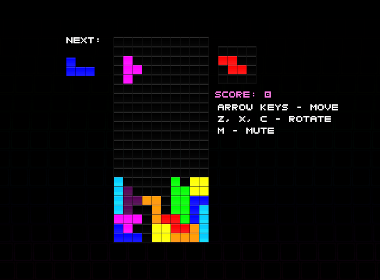
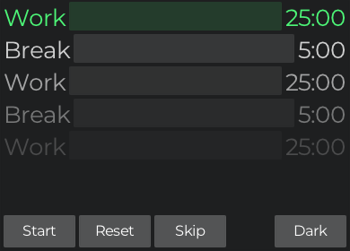

# tophat

Tophat is a friendly 2d game engine for the [Umka](https://github.com/vtereshkov/umka-lang) programming language.
Visit the [homepage](https://th.mrms.cz/) for more info.
You can browse the documentation on the [wiki](https://github.com/marekmaskarinec/tophat/wiki).

## screenshots

<p align="center">
	
	
	
	
</p>

## examples

Creating a moving rectangle is as easy as this:

```go
import ("th.um"; "rect.um"; "input.um"; "canvas.um"; "window.um")

fn main() {
	const (
		cam = rect.Rect{0, 0, 200, 200}
		speed = 100
	)

	window.setup("my game", 400, 400)

	pos := th.Vf2{100, 100}

	for window.cycle(cam) {
		var change: th.Vf2

		// Handle input
		if input.isPressed(input.key_left)  { change.x -= 1 }
		if input.isPressed(input.key_right) { change.x += 1 }
		if input.isPressed(input.key_up)    { change.y -= 1 }
		if input.isPressed(input.key_down)  { change.y += 1 }

		// Apply movement
		pos = pos.add(change.norm().mulf(speed * th.delta / 1000.0))

		// Draw!
		canvas.drawRect(th.green, rect.mk(pos.x, pos.y, 10, 10))
	}
}
```

You can look at more complex examples in the [`examples/`](https://github.com/marekmaskarinec/tophat/tree/main/examples) folder.

## license

Tophat is licensed under the BSD-3 license.
